# ICP — In-Context Pruning

Experiments on **usefulness masks for pruning LLM context**: measuring which
parts of the context actually matter, aggregating that signal across tasks and
time, and pruning the rest — without hurting (and sometimes improving) accuracy.

Core idea: a shared skill document (company docs, procedural knowledge) bloats
over time with dead knowledge. After each task, generate a **usefulness mask**
over skill chunks. Aggregate masks across tasks / time, then mask away the
consistently-least-useful chunks for future tasks.

All experiments run on CPU with `Qwen/Qwen2.5-0.5B-Instruct` unless noted.
Small model → noisy absolute numbers, but the *paired contrasts* are the findings.

## Experiments

| # | Script | Question |
|---|--------|----------|
| 01 | `01_attention_vs_usefulness.py` | Do LLM-generated usefulness maps agree with real attention matrices? (+ ablation as causal reference) |
| 02 | `02_multi_question_pruning.py` | For two questions, is it better to keep-what-Q2-needs or forget-what-Q1-needed? |
| 03 | `03_skill_bloat_pruning.py` | Given n tasks, can per-task masks find globally-dead skill chunks to prune before task n+1? |
| 04 | `04_hard_vs_soft_demo.py` | First demo: hard skill deletion vs soft attention masking |
| 05 | `05_hard_vs_soft_rigorous.py` | Reviewer-grade eval of hard vs soft with poison orderings + bootstrap CIs |
| 06 | `06_mask_prediction_qonly.py` | Can the mask be predicted from the question alone (no answer)? LLM judge vs TF-IDF retrieval |
| 07 | `07_time_ema_routing.py` | Time-only EMA routing under task autocorrelation (no question content) |
| — | `visualize_masks.py` | Renders masks as highlighted skill text (`figures/textmap_*.png`) |

Design note: `05_hard_vs_soft_rigorous.py` is the methodological core —
poison-before-live vs poison-after-live as causal control, paired items,
2000-resample bootstrap 95% CIs, and a sanity condition. See
`EVAL_HARD_VS_SOFT.md`.

## Key findings

1. **Attention ≠ self-reported usefulness ≠ causal importance.** Mean
   Spearman(attention, LLM map) ≈ 0.25. Ablation is the sharp reference;
   the rest are proxies. (01)
2. **Keep-current beats forget-previous.** Pruning to the new question's mask
   matched the oracle keep-set and improved confidence vs full context. (02)
3. **n-task aggregation finds dead chunks.** Measure on tasks 1..n, aggregate
   by max-across-tasks, prune once before n+1. (03)
4. **Soft answer-only masking leaks; deletion doesn't.** hard−soft = +0.44
   logprob (95% CI excludes 0) when poison precedes live text; gap vanishes in
   the causal control. Leakage happens during prefilling into other tokens. (05)
5. **Routing from the question alone is retrieval, not judgment.** TF-IDF
   ranked the true key chunk #1.0 on average; the 0.5B LLM router collapsed
   (25% downstream accuracy). (06)
6. **Time-only EMA routes within a session.** λ=0.9 matched full-context
   accuracy (0.875) with ~44% fewer chunks; one stale step per topic switch. (07)
7. **EMA state is session-local.** Shared global EMA suffers negative transfer
   across chats; share only slow artifacts (global dead-set, cluster priors). (07 + sim)

## 01 — Attention vs usefulness vs ablation

Three synthetic facts. For each, compare (normalized) last-layer attention,
an LLM-judged usefulness map, and causal ablation (`max(0, lp_full − lp_redact i)`).

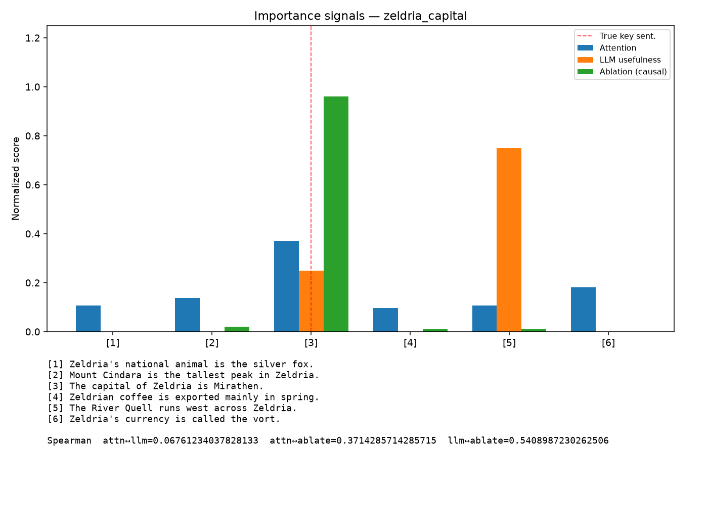

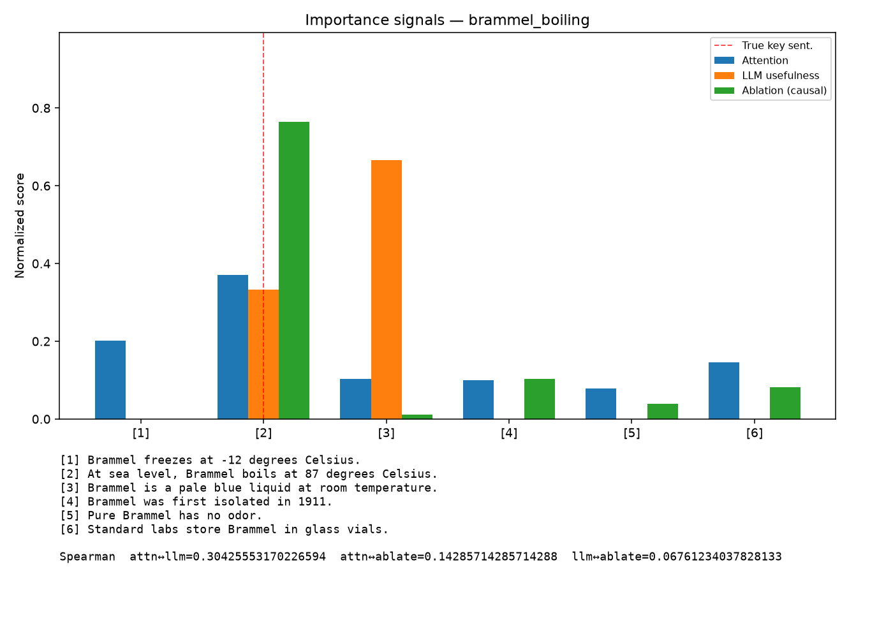

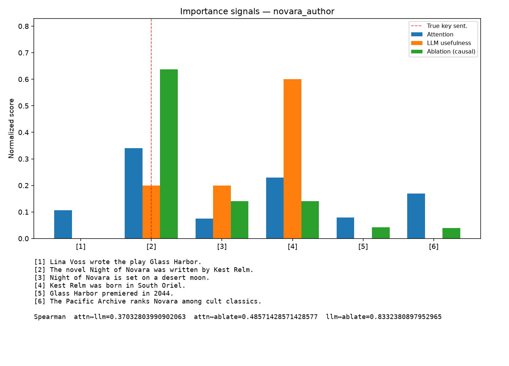

Spearman agreement across the three examples: attention vs LLM map is weak
(~0.25 mean). Ablation is the sharp reference.

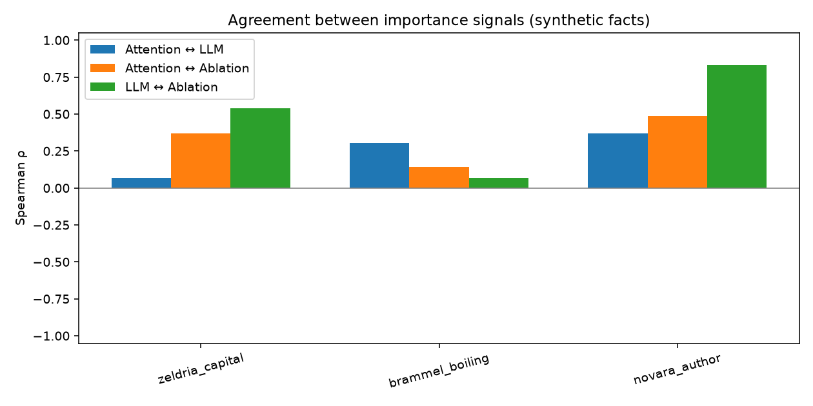

## 02 — Keep-current vs forget-previous

Two questions over a mixed context. Maps differ by question; pruning to Q2's
mask beats forgetting whatever Q1 needed.

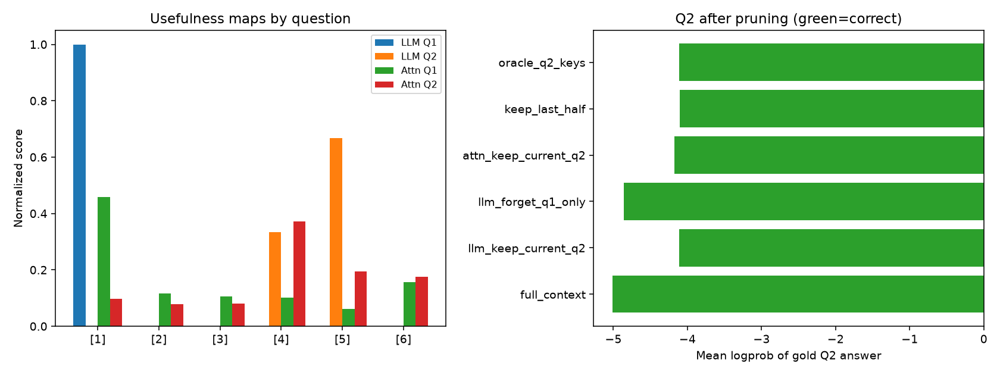

## 03 — Skill bloat: prune dead chunks before task n+1

Shared 10-chunk company skill. Mask after each of tasks 1..n, take
max-across-tasks, drop globally-dead chunks, then run task n+1.

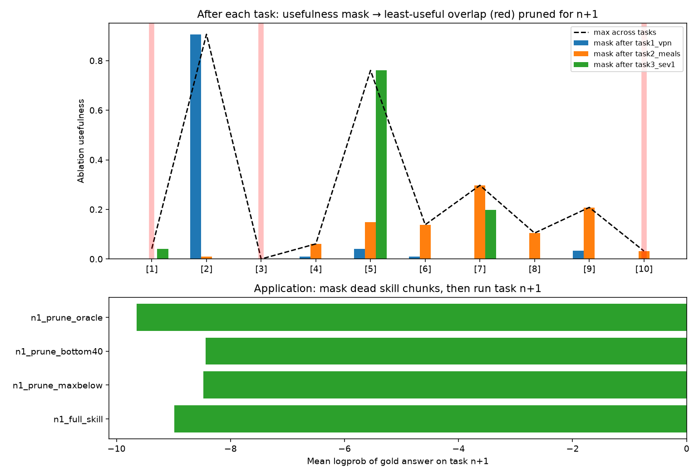

Post-hoc ablation masks painted on the skill text (one panel per task). Brighter
red = more useful for that task.

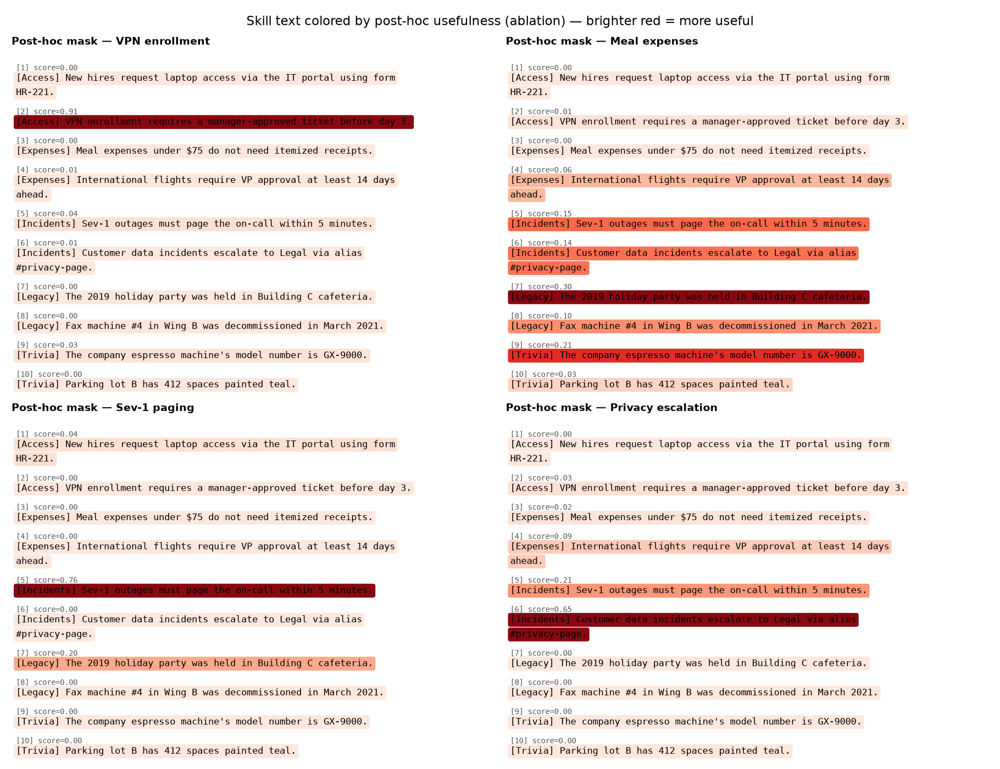

## 04 — Hard delete vs soft attention mask (demo)

First demo: deleting dead/poison tokens from the prompt vs blocking attention
to them only at the answer. Soft answer-only masking retains full-context
leakage (`leakage_index = 1.0` on this item).

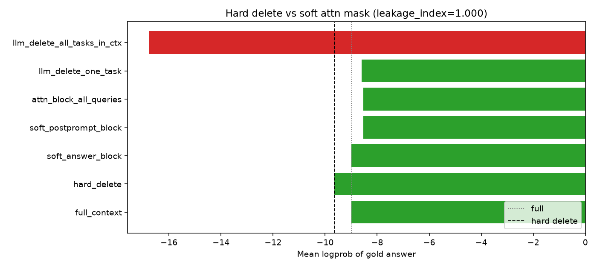

## 05 — Hard vs soft, poison-order control

8 items × 2 poison orders × 5 conditions. Bootstrap 95% CIs.
`hard − soft ≈ +0.44` when poison precedes live text; the gap vanishes when
poison comes after (causal control). Leakage is prefilling into other tokens,
not the answer-query attention edge.

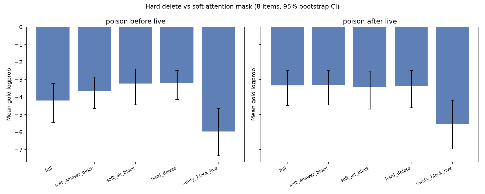

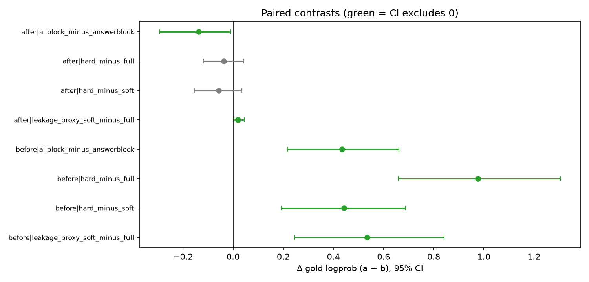

## 06 — Predict the mask from the question alone

No answer, no post-hoc ablation at test time. TF-IDF retrieval finds the true
key chunk (mean rank 1.0); the 0.5B LLM judge collapses (flat / all-yes on
Sev-1, 25% downstream accuracy).

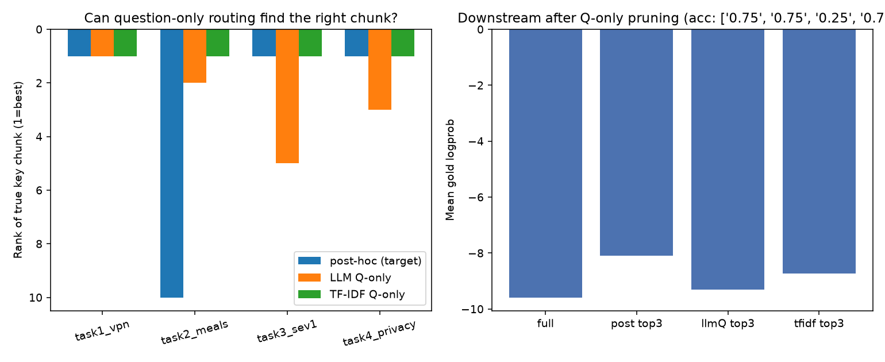

Sev-1 is the dramatic case: true post-hoc mask vs LLM question-only vs TF-IDF.

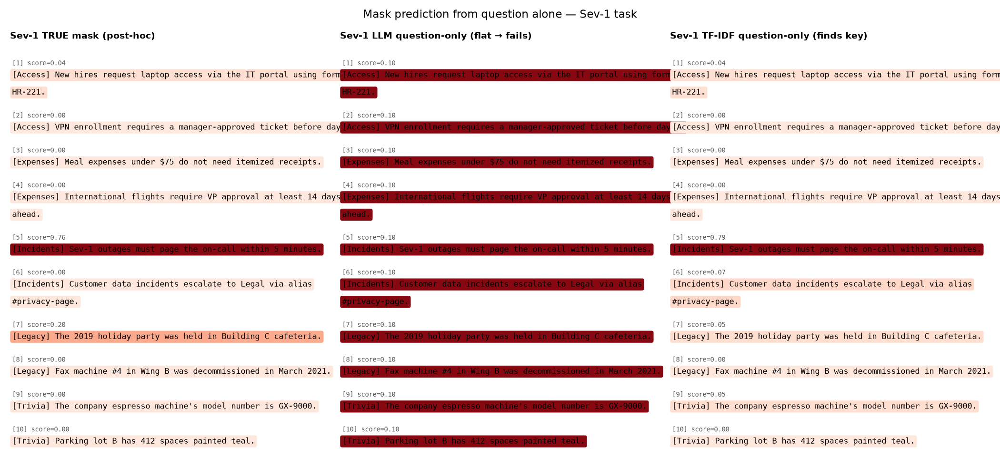

## 07 — Time-only EMA routing

16-step Markov task stream (ρ=0.75). Mask after every step; apply EMA_{t−1} as
the keep-set for the next step. No question text is used for routing. λ=0.9
matches full-context accuracy (0.875) while keeping 5.6 / 10 chunks.

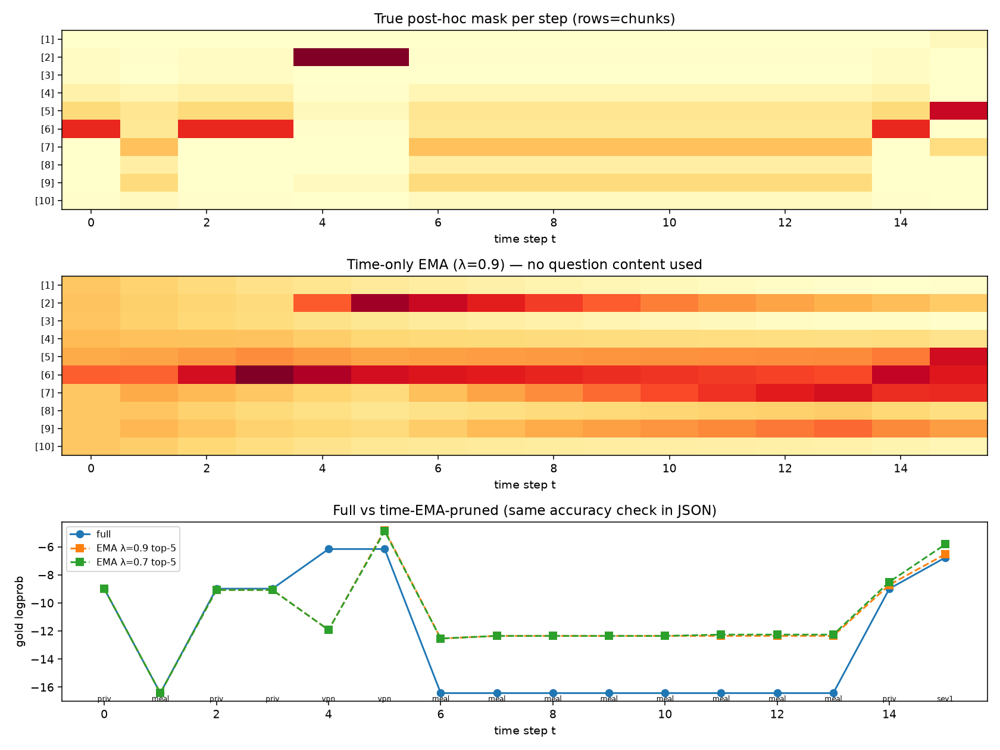

What the time-only EMA router “sees” before selected steps (λ=0.9).

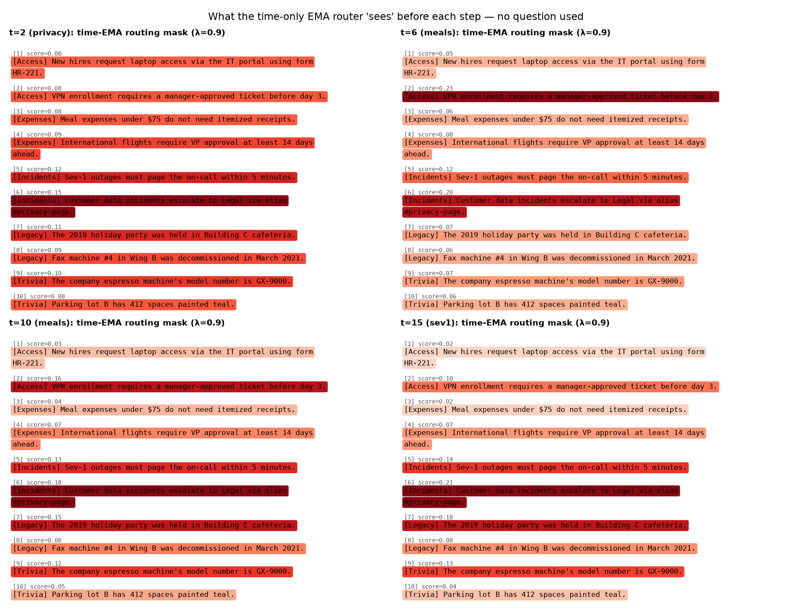

EMA state is session-local. A shared global EMA drops the other session's key
chunk after a topic switch; per-session EMA does not.

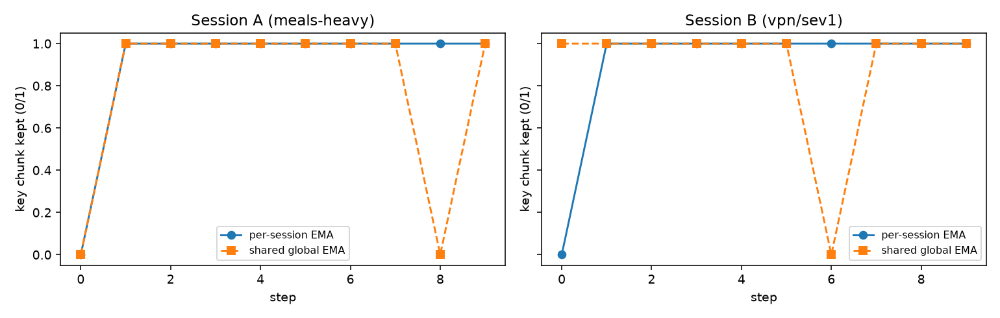

## Run

```bash
pip install -r requirements.txt
python3 05_hard_vs_soft_rigorous.py   # the flagship eval (~2 min on CPU)
python3 07_time_ema_routing.py        # time-EMA routing demo
python3 06_mask_prediction_qonly.py   # question-only routing
python3 visualize_masks.py            # highlighted-text figures
```

JSON summaries go to `artifacts/` (gitignored). Figures are written to
`figures/*.png` and checked in so this README renders on GitHub.

## Limitations

- Single small model (0.5B), synthetic skills/facts — directionally informative,
  not production-scale evidence.
- Soft-mask generation-time accuracy is logprob-based (custom 4D attention
  biases can't be applied inside `generate`); greedy-decode accuracy under
  soft masks is secondary.
- LLM judge masks are noisy at this scale; ablation is the stable signal.

## License

MIT — see `LICENSE`.
